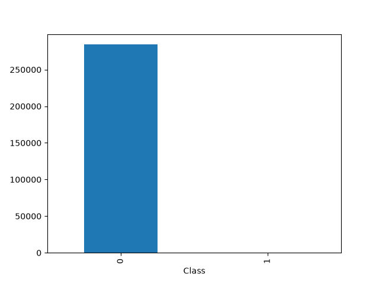
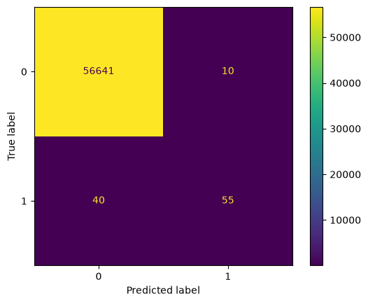

# Fraudulent Transaction Detection

## 1. Introduction

### 1.1 Project Goal

**Project Goal: Fraudulent Transaction Detection**

In this project, our goal is to build a model that can distinguish fraudulent transactions from non-fraudulent transactions with the highest possible accuracy.

### 1.2 Challenge: Class Imbalance

**Challenge: Class Imbalance**

The number of fraudulent transaction samples is very small, which makes it difficult for the model to correctly identify fraudulent transactions.

Due to the class imbalance, the model can achieve high accuracy; however, because there are very few fraudulent transaction samples, it becomes difficult for the model to correctly identify fraudulent transactions.

---

## 2. Dataset

### 2.1 Introduction to the Dataset

**Introduction to the Dataset**

This dataset is a fraud detection dataset.

It contains 1,081 duplicate samples and no missing values. The dataset consists of 30 features and 284,807 samples.

Among these samples, 492 are fraudulent transactions and 284,315 are non-fraudulent transactions.

Class 0 represents non-fraudulent transactions, while Class 1 represents fraudulent transactions.

---

## 3. Exploratory Data Analysis (EDA)

The first step in examining the data is to draw a class distribution diagram.

As can be seen from the diagram, the class data is highly imbalanced, and the number of fraudulent transaction samples is very low compared to non-fraudulent samples.

### 3.1 Class Distribution

**Class Distribution Diagram**

<!-- Add class distribution image here -->



99.82% of the samples are non-fraudulent samples, and only about 0.172% of the samples are fraudulent transaction samples, which indicates that the data is highly imbalanced.

### 3.2 Missing Values

In the next step, the observations were checked to see if there was any missing or null data in the dataset, which was found to be absent.

### 3.3 Duplicate Samples

In the next step, the number of duplicate samples was checked. In this dataset, there were 1,081 duplicate samples.

### 3.4 Outlier Analysis

To examine the outlier data, since the values V1 to V28 are features whose type and nature are unknown, and removing the outlier data of these features could disrupt the learning process, none of them were removed.

However, the outlier values of the Amount attribute were examined. There were 31,685 outlier samples, of which only 87 were fraudulent transactions, indicating that outlier data in the Amount attribute does not have a significant impact on the fraudulent nature of transactions.

### 3.5 Feature Selection

After training the Decision Tree model, the feature importance scores were examined to determine which features contributed more to the model's predictions.

Features with higher importance scores were selected and used in the subsequent modeling steps. This allowed the model to focus on the features that had a greater contribution to its predictions while reducing the number of features used for training.

<!-- Add Amount outlier visualization here -->
# 4. Data Preprocessing

## 4.1 Duplicate Removal

In the first stage of data preprocessing, duplicate samples were removed. Removing duplicate samples was necessary because if identical observations were present in both the training and testing sets, they could lead to data leakage and result in an overly optimistic evaluation of the model.

## 4.2 Train-Test Split

After removing the duplicate samples, the dataset was divided into two sets: a training set and a testing set.

Due to the class imbalance in the dataset, stratified splitting was used to preserve the class distribution between the training and testing sets.

The `test_size` was set to 0.2, meaning that 80% of the data was used for training and 20% was reserved for testing. This allowed the model to use a larger portion of the available data for training while keeping a separate test set for final evaluation.

The `random_state` was set to 42 to ensure reproducibility.

```python
X_train, X_test, y_train, y_test = train_test_split(
    x,
    y,
    test_size=0.2,
    random_state=42,
    stratify=y
)
```

## 4.3 Feature Selection

After splitting the dataset, feature importance was evaluated using the training data and the Decision Tree model.

The features with higher feature importance scores were selected as input features for the subsequent modeling steps.

The selected features were:

```python
 ['V14', 'V17', 'V10', 'V12', 'V4', 'V28', 'V26', 'V27', 'Time', 'V7', 'V20', 'V8', 'V9', 'V25', 'V1', 'V6', 'V22', 'V18', 'V21', 'V2']
```

These features were selected because they had higher importance scores in the Decision Tree model and therefore contributed more to its predictions.

## 4.4 Feature Scaling

StandardScaler was used to standardize the scale of the features. Scaling is particularly important for models such as KNN and Logistic Regression, where differences in feature scales can affect the model's performance.

The scaler was fitted only on the training data and then used to transform both the training and testing data. Fitting the scaler on the test data could lead to data leakage because information from the test set would be used during the preprocessing stage.

```python
scaler = StandardScaler()

X_train_scaled = scaler.fit_transform(X_train)
X_test_scaled = scaler.transform(X_test)
```

In this process, `fit_transform()` was applied only to the training data, while the test data was transformed using the parameters learned from the training data.

---

## 4.5 Handling Imbalanced Data

One of the main challenges of this project is the severe imbalance between fraudulent and non-fraudulent transactions.

Due to this class imbalance, a model can achieve a high accuracy by predicting most transactions as non-fraudulent. However, high accuracy does not necessarily indicate good model performance in this case, because the main objective is to correctly identify fraudulent transactions.

In this project, accuracy is therefore not considered an appropriate metric for evaluating the model's performance. Since the model is intended to detect fraudulent transactions, it is important for the model to identify as many fraudulent transactions as possible.

For this reason, Recall is considered one of the most important evaluation metrics in this project. A higher Recall means that the model is able to identify a larger proportion of the actual fraudulent transactions.

The goal is to maximize Recall as much as possible while maintaining a reasonable balance between Recall and Precision and avoiding an excessive increase in false positive predictions.

To address the class imbalance and improve the model's ability to detect the minority class, different sampling techniques were investigated. These techniques included oversampling, undersampling, and combined sampling methods.

The sampling techniques used in this project were:

### Oversampling

* SMOTE
* ADASYN

### Undersampling / Data Cleaning

* Tomek Links

### Combined Sampling

* SMOTE-Tomek


# 5 First Experiment: Baseline Experiment

At this stage, we evaluate the performance of the models on the data without applying any special settings or optimization.

At this stage, we examine the evaluation metrics, including Recall, Precision, F1 score, and the confusion matrix of each model.

## Initial Results

The initial results obtained from a specific split of the data for each model are as follows:

### 5.1 Accuracy

| Model               | Accuracy Train | Accuracy Test |
| ------------------- | -------------: | ------------: |
| Logistic Regression |       0.999207 |      0.999119 |
| KNN Model           |       0.999599 |      0.999418 |
| Decision Tree       |       0.999612 |      0.999330 |
| Random Forest       |       0.999546 |      0.999436 |

### 5.2 Precision

| Model               | Precision Train | Precision Test |
| ------------------- | --------------: | -------------: |
| Logistic Regression |        0.877863 |       0.846154 |
| KNN Model           |        0.949843 |       0.955882 |
| Decision Tree       |        0.942073 |       0.880000 |
| Random Forest       |        0.943662 |       0.943662 |

### 5.3 Recall

| Model               | Recall Train | Recall Test |
| ------------------- | -----------: | ----------: |
| Logistic Regression |     0.608466 |    0.578947 |
| KNN Model           |     0.801587 |    0.684211 |
| Decision Tree       |     0.817460 |    0.694737 |
| Random Forest       |     0.761905 |    0.705263 |

### 5.4 F1 Score

| Model               | F1 Train |  F1 Test |
| ------------------- | -------: | -------: |
| Logistic Regression | 0.718750 | 0.687500 |
| KNN Model           | 0.869440 | 0.797546 |
| Decision Tree       | 0.875354 | 0.776471 |
| Random Forest       | 0.848306 | 0.807229 |

###  5.5 Confusion Matrix Results

### Logistic Regression Model



### KNN Model


### Decision Tree Model


### Random Forest Model


However, since these results were obtained from a specific split of the data, they may not be completely reliable. Therefore, cross-validation is necessary to obtain a more reliable evaluation of the models' performance.

### 5.6 Cross-Validation Results

The results of cross-validation are as follows:

| Model | Mean Accuracy | Mean Recall | Mean Precision | Mean F1 |
|---|---:|---:|---:|---:|
| Logistic Regression | 0.999129 | 0.589474 | 0.869811 | 0.680979 |
| KNN Model | 0.999285 | 0.729115 | 0.848228 | 0.775246 |
| Decision Tree | 0.800663 | 0.779910 | 0.713083 | 0.640749 |
| Random Forest | 0.999337 | 0.725062 | 0.889420 | 0.783736 | 

Based on the cross-validation results, all models performed worse than in the initial single-split evaluation. Among the evaluated models, the Random Forest model achieved the best overall performance in cross-validation.

Therefore, the Random Forest model was selected for further experiments.


## 6. Experiment 02: Class Weight

### 6.1 Experiment Objective

We observed the results without feature selection.

Since the model is highly imbalanced, one of the methods that can be applied is `class_weight='balanced'`.

In this method, the model assigns more weight to the class that has fewer examples, which in this case is class 1 (Fraud).

Therefore, it is worth examining the performance of the model in both cases.

The Random Forest model was selected for further experiments because it achieved the highest F1 score in cross-validation.

### 6.2 Comparison of Normal and Weighted Methods

In the first stage, I compared the model in two ways:

1. Normal
2. Weighted

The purpose of this comparison was to examine the difference in model performance between the normal mode and the mode using:

```python
class_weight='balanced'
```

In the second method, when `class_weight='balanced'` is applied, the model gives more importance to the samples belonging to the minority class, which in this case is class 1 (Fraud).

The advantage of this approach is that the Recall can increase, allowing more fraudulent transactions to be detected.

### 6.3 Results

The results obtained in both cases are as follows:

**Method 1: Normal**


**Method 2: Weighted**


### 6.4 Analysis of the Results

As is clear from the results obtained, in the second method, both TP and FP have increased. This indicates that with weighting, Recall increases while Precision decreases sharply.

However, without weighting, although the Recall value is relatively lower and there are fewer TP values, there are also fewer FP values. Therefore, the Precision and Recall values are closer to each other, resulting in a more balanced model performance.

### 6.5 Conclusion

Based on the conclusion drawn from this section, my choice here is the method that provides a more balanced Precision and Recall.

It is true that Recall is our most important criterion in this project, but this improvement in Recall should not come at the cost of a very low Precision and an unbalanced model performance.

Therefore, my choice is the first method, the method without weighting.


## 7. Experiment 03: Feature Selection

### 7.1 Feature Importance

At this stage, we intend to try to select the most effective features in training the model.

Since Random Forest is currently selected as the model, we select the important features according to this model using:

```python
model.feature_importances_
```

According to the results obtained, the importance of each feature is determined. Based on the results, V17 is the most important feature.

The feature importance values are:

```text
[0.00564158 0.00742255 0.00763433 0.01190255 0.02872176 0.00800408
 0.01718152 0.02935361 0.01325496 0.03049093 0.12849721 0.06064548
 0.12828836 0.00367727 0.14990513 0.00485518 0.06862350 0.17676839
 0.02395539 0.00622665 0.00717190 0.01699604 0.00584957 0.00445719
 0.00601504 0.00422686 0.01941772 0.01062120 0.00695445 0.00723958]
```

### 7.2 Selecting the Number of Features

Since the importance is not the only criterion and some features may have low importance but their existence is necessary for the model to perform better, at this stage, it should be done in multiple stages.

Let's try different numbers of important features on the model to find out which of the features can give the model better performance.

### 7.3 Comparison of Feature Sets

In the different tests that were conducted, almost all the results were similar, but in three cases the model performed very slightly better.

The three selected cases were:

**Top 7**


**Top 11**


**Top 20**


These results correspond to using 7, 11, and 20 features.

### 7.4 Analysis of the Results

All three have detected 70 fraudulent transactions in this test, but in the 20-feature set, the number of non-fraudulent transactions that are detected incorrectly (FP) is less than in the other two feature sets.

So, the first 20 important features are selected as the final features.


